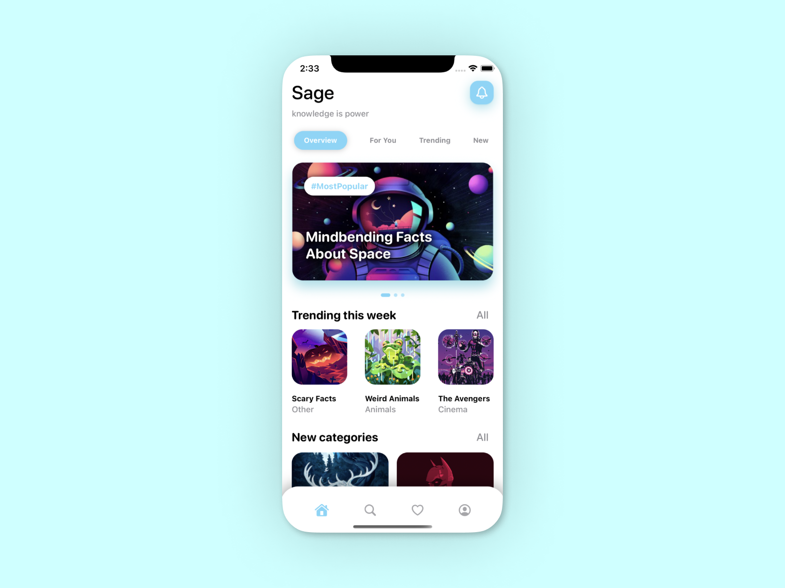
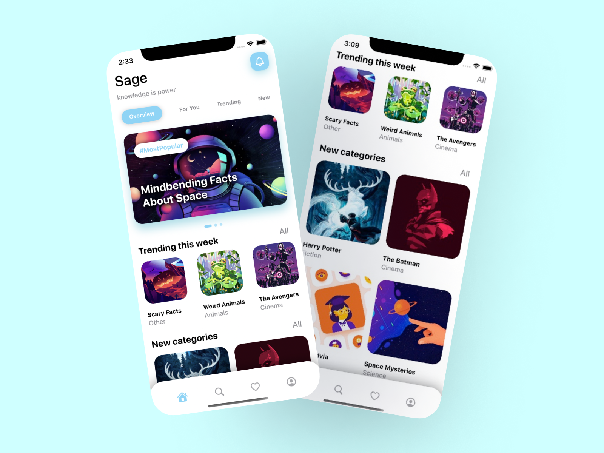

# 🧐 Sage - Daily Facts App

This repo presents my frontend design (software) for a daily facts app. I was looking to make a "Motivation App" style iOS app that uses notifications and widgets to send random fun facts to a user. After countless iterations, this is the UI design that I ended up with. Note that not all features are functional. For example, the buttons do not link to other page views and the sliders do not adapt to the sliding gesture. Rather, the goal here is to show how one can make a clean and aesthetically pleasing frontend design in Swift UI. Please feel free to fork the project and improve the UI or add in functionality to the buttons and sliders.

 

## App Mockups

|Static Design|App Animation|
|:-:|:-:|
|||

 

 

